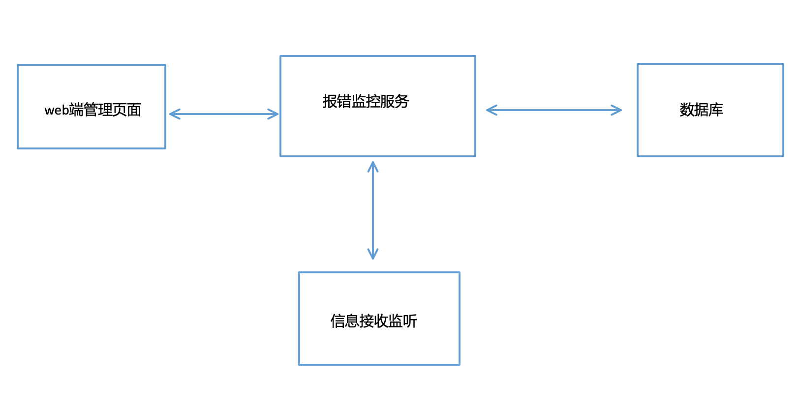
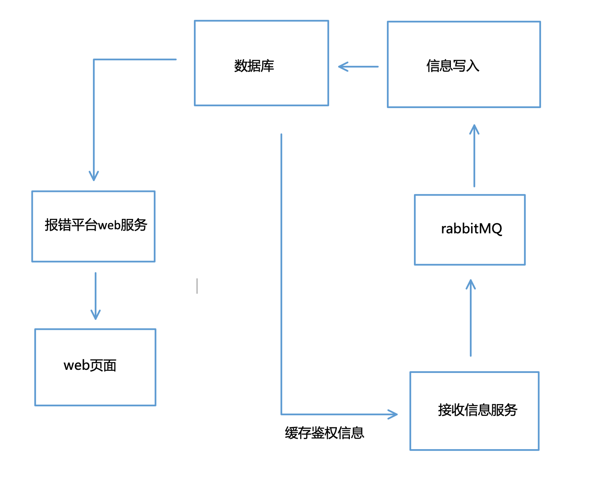

# RabbitMQ 消息队列使用与思路用例

## 用途

### 解耦

分拆服务，可保证各个功能服务独立，需要增加提供数据节点和接收数据只需要将对应服务添加到 mq 对应 channel 的配置中，增加服务灵活性和稳定性

### 异步

当业务接口不需要要求立刻返回传送结果时（短信、工单等信息推送），数据扔给 mq 后即可结束方法运行。不需要等待接下来的系统回应（数据库，其他服务等）。降低资源占用，提高服务效率

### 削峰

大量数据进入场景时作为作为缓冲使用，服务直接将数据发送至消息队列。后续业务通过分批逐条接收信息进行处理，防止峰值量请求导致服务崩溃

## 为什么

- 可靠性。支持持久化，传输确认，发布确认等保证了 MQ 的可靠性。
- 灵活的分发消息策略。这应该是 RabbitMQ 的一大特点。在消息进入 MQ 前由 Exchange(交换机)进行路由消息。分发消息策略有：简单模式、工作队列模式、发布订阅模式、路由模式、通配符模式。
- 支持集群。多台 RabbitMQ 服务器可以组成一个集群，形成一个逻辑 Broker。
- 多种协议。RabbitMQ 支持多种消息队列协议，比如 STOMP、MQTT 等等。
- 支持多种语言客户端。RabbitMQ 几乎支持所有常用编程语言，包括 Java、.NET、Ruby 等等。
- 可视化管理界面。RabbitMQ 提供了一个易用的用户界面，使得用户可以监控和管理消息 Broker。
- 插件机制。RabbitMQ 提供了许多插件，可以通过插件进行扩展，也可以编写自己的插件。

## 基本定义

- Broker：消息队列服务进程。此进程包括两个部分：Exchange 和 Queue。
- Exchange：消息队列交换机。按一定的规则将消息路由转发到某个队列。
- Queue：消息队列，存储消息的队列。
- Producer：消息生产者。生产方客户端将消息同交换机路由发送到队列中。
- Consumer：消息消费者。消费队列中存储的消息。


```golang
type RabbitMQ struct {
 conn    *amqp.Connection
 channel *amqp.Channel
 //队列名称
 QueueName string
 //交换机
 Exchange string
 //key
 Key string
 //连接信息
 Mqurl string
}

// 通用方法
// 创建RabbitMQ实例
func NewRabbitMQ(queuqName string,
 exchange string, key string) *RabbitMQ {
 rabbitmq := &RabbitMQ{
  QueueName: queuqName,
  Exchange:  exchange,
  Key:       key,
  Mqurl:     MQURL,
 }
 //创建rabbitmq连接
 var err error
 rabbitmq.conn, err = amqp.Dial(rabbitmq.Mqurl)
 // fmt.Println(err, "创建连接错误")
 rabbitmq.failOnErr(err, "创建连接错误")
 rabbitmq.channel, err = rabbitmq.conn.Channel()
 rabbitmq.failOnErr(err, "获取channel失败")
 return rabbitmq
}
```

## 使用

### 日志处理



前端报错信息统一由单一服务负责信息的接收、写入、处理 web 端平台的配置管理、日志读取功能



服务基本分拆为 web 平台服务、信息写入、信息接收三个部分

定义好 QueueName 的情况下可无限扩展接收信息的服务数量（多对多匹配已经按照 Exchange 配置等进行规则性匹配）

实践测试接收服务可承载瞬间 5000+以上的大量请求，而数据入库部分由信息写入服务进行处理。在 mqsql 写入速度在 5 条/s 限制下能平稳处理掉瞬发数据

- **_多数据源并发时无法保证消息队列的顺序，对顺序强需求时需要在数据中定义_**

### 消息推送

MQTT 协议自带的功能能更方便的获取接收方的在线情况。信息可直接交给 rabbitMQ 后由消费端自行提取使用。**无论是 js 端还是 flutter 端均有对应的 MQTT 协议包可供调用**

- **_但是信息历史和信息推送需要分别进行处理，mq 无法对已推送的信息进行查找_**

- js `paho-mqtt`
- flutter `mqtt_client`

```go
//接受消息
 msgs, err := r.channel.Consume(
  r.QueueName,
  //用于区分多个不同的消费者
  "",
  //是否自动应答，也就是消费者消费一个队列后是否主动告知rabbitmq当前的消息我已经消费完
  //rabbitmq会根据这个判断是否可以删除该消息
  //为false的话要手动实现
  true,
  //是否具有排他性
  false,
  //如果为true不能在同一个connection中发送消息传递给当前conn的消费者
  false,
  false,
  nil,
 )
 if err != nil {
  log.Println(err)
 }

 forever := make(chan bool)

 defer stop(forever)

 go func() {
  for d := range msgs {
   fmt.Println("reciving msg from MQ")
   fmt.Println(d.Body)
   //实现其他的逻辑函数
  }
 }()
 log.Println("waiting for message")
 <-forever
```
